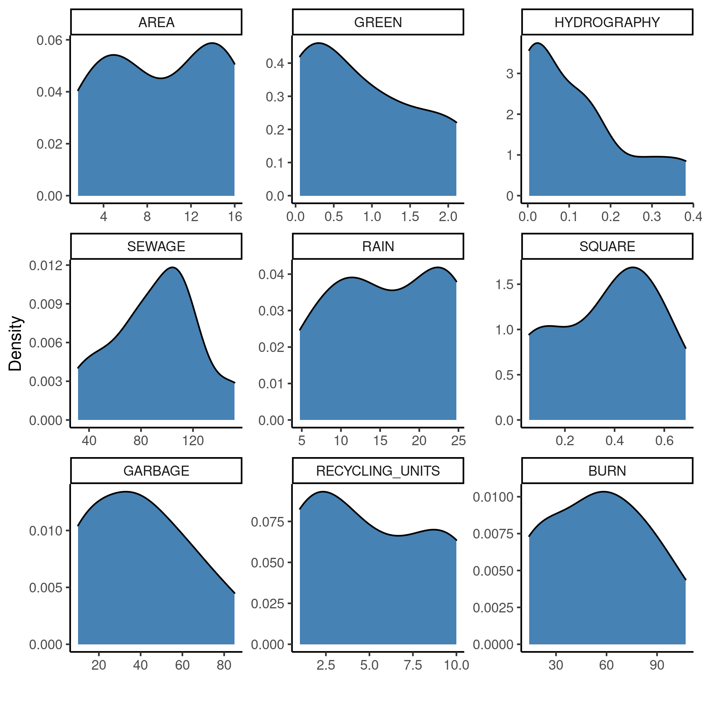
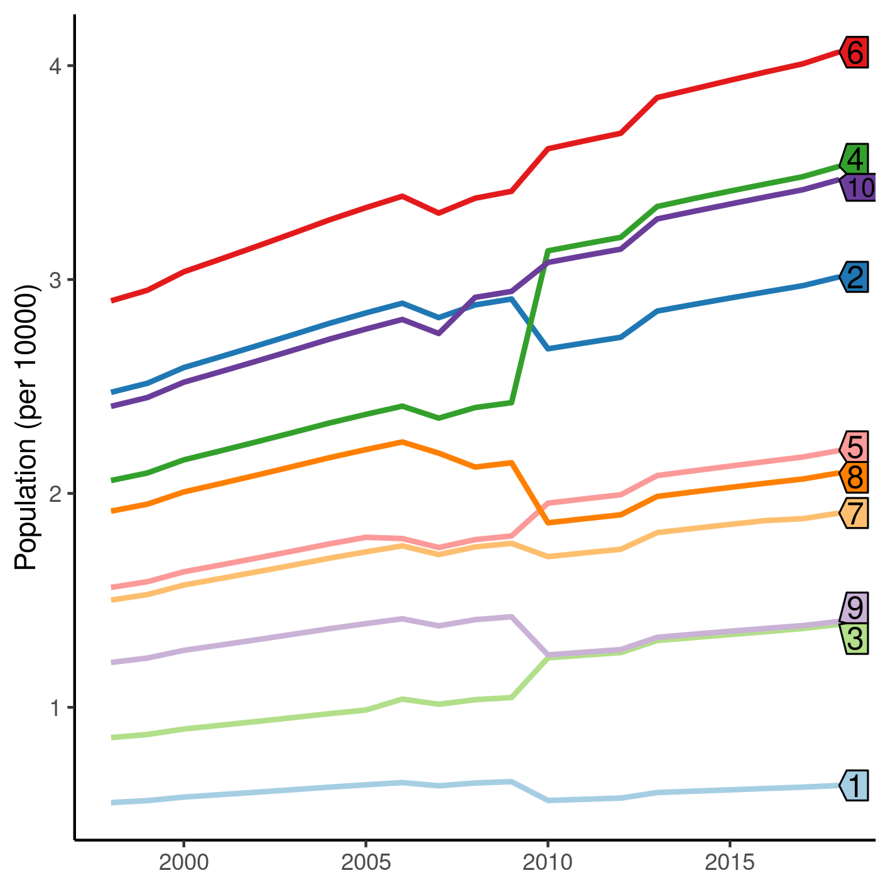

---

\newpage

**Incidence rates of scorpion accidents in Urban Planning Areas of Americana/SP in 1998--2018**

**Document version**

|Version |Alterations     |
|:-------|:---------------|
|01      |Initial version |

---

# Abbreviations

# Context

## Objectives

Describe the incidence rates of scorpion accidents in ten Urban Planning Areas of Americana/SP between 1998 and 2018.

## Data reception and cleaning

# Methods

## Variables

### Primary and secondary outcomes

### Covariates

## Statistical analyses

This analysis was performed using statistical software `R` version 4.1.3.

# Results

## Study population and follow up

### Urban Planning Areas

Table: **Table 1** caption

|**Characteristic**                   |      **N = 10**      |
|:------------------------------------|:--------------------:|
|__Sewage network (km)__              |                      |
|Mean (SD)                            |       91 (35)        |
|Median (IQR)                         |     96 (72, 109)     |
|Range                                |       32, 152        |
|__Rainwater network (km)__           |                      |
|Mean (SD)                            |      16.0 (7.5)      |
|Median (IQR)                         |  15.4 (11.5, 22.8)   |
|Range                                |      4.8, 24.7       |
|__Green areas (km²)__                |                      |
|Mean (SD)                            |     0.87 (0.81)      |
|Median (IQR)                         |  0.70 (0.18, 1.39)   |
|Range                                |      0.06, 2.11      |
|__Irregular garbage disposal areas__ |                      |
|Mean (SD)                            |       40 (25)        |
|Median (IQR)                         |     38 (18, 56)      |
|Range                                |        10, 85        |
|__Informal recycling units__         |                      |
|Mean (SD)                            |     4.20 (3.05)      |
|Median (IQR)                         |  3.50 (1.25, 7.50)   |
|Range                                |      1.00, 8.00      |
|__Junkyard units__                   |                      |
|Mean (SD)                            |     1.90 (2.18)      |
|Median (IQR)                         |  2.00 (0.00, 2.75)   |
|Range                                |      0.00, 7.00      |
|__Burned-out areas (foci)__          |                      |
|Mean (SD)                            |       55 (31)        |
|Median (IQR)                         |     52 (27, 78)      |
|Range                                |       14, 107        |
|__Area (km²)__                       |                      |
|Mean (SD)                            |      9.3 (5.5)       |
|Median (IQR)                         |   9.3 (5.2, 14.2)    |
|Range                                |      1.7, 16.0       |
|__Hydrography area (km²)__           |                      |
|Mean (SD)                            |    0.023 (0.019)     |
|Median (IQR)                         | 0.020 (0.008, 0.038) |
|Range                                |     0.002, 0.053     |
|__Railway lines (km)__               |                      |
|Mean (SD)                            |     1.60 (1.97)      |
|Median (IQR)                         |  0.93 (0.00, 2.60)   |
|Range                                |      0.00, 5.65      |
|__Municipal recycling units__        |                      |
|Mean (SD)                            |     0.90 (0.74)      |
|Median (IQR)                         |  1.00 (0.25, 1.00)   |
|Range                                |      0.00, 2.00      |
|__Presence of a cemitery, n (%)__    |       2 (20%)        |

**Figure 1** Distribution density of characteristics in ten urban planning areas (UPA) in Americana/SP (1998-2008).

### Population

The population in all ten UPA have increased from
174426 to
237022 people during the 1998 -- 2008 period.
The three UPA that showed the largest population increase were
UPA 4, 6 and 10 with
14689,
11639 and
10600 net growth, respectively (Figue 2).
On the other hand the three UPA with the lowest population growth in the period were
UPA 1, UPA 8 and UPA 9 with
802,
1790 and
1917 new persons, respectively.

**Figure 2** Population trajectories in ten urban planning areas (UPA) in Americana/SP (1998-2008).

While population grew in all UPA, in most cases the trajectory did not follow a monotonic trend.
In particular population at UPA 4 and 8 did not grow steadily in order to reach the to the ranks of top 3 and bottom 3 in either absolute number and net growth.

UPA 4 and 8 started with similar population sizes, but at the end of the study period had dramatic final population differences.
Both did not start among the largest populations but UPA 4 had a sharp population increase while UPA 8 had a sharp decrease, at around the same period.
Having started with a similar population size, the final difference between the final population at these two particular UPA could be explained by this shift.

Furthermore, UPA 2 and 9 had a sharp decrease around the same period before resuming the slower, predictable growth rate of previous years.
UPA 2 had started with the second largest population of the ten UPA at 1998 and ended at the fourth largest population.

It is difficult to assess the impact of such rapid movements in population size in the accident rates.
<!-- If our assumption that the population is a proxy exposure for the risk of scorpion accidents, these rapid movements should be associated with the incidence risk. -->
<!-- Other possible explanations include a threshold population size, beyond which the risk is substantially increased. -->
We will assess this impact in the section 4.2.

## Incidence of scorpion accidents

The models used in this analysis allow for the estimation of the expected number of scorpion accidents per 10000 persons (Table 2).
UPA 10 was chosen as the baseline for comparison for having the lowest absolute risk in the full model.
Table 2 shows how the risk in other UPA compares to the risk in the reference UPA.

Without the assumption of incidence growth, the baseline risk of scorpion accident was
7.24 accidents per UPA
(Crude estimate in Table 2).
n this simpler model, while most UPA appear to have larger numbers of expected accidents, risk ratios varied between a 50% decrease (UPA 8) to an 100% increase (UPA 3), when compared to the reference UPA.

With the assumption of incidence growth (Fully adjusted in Table 2), varying by UPA across the study period, the baseline risk of scorpion accident was
0.83 accidents per UPA.
For each year, on there was an average increase of
1.17 accidents
and besides this, every UPA had their own independent incidence rate estimated.
After controlling for this, the three UPA with the largest IRR compared to the baseline risk were UPA 4, 7 and 5, while the smallest increase were observed in UPA 2, 8 and 3.
In this model, the increase in risk of accidents varied between 70% increase (UPA 2) to approximately 800% increase (UPA 4), when compared to UPA 10.
UPA 2 was the only region that had less than 100% increased population risk of scorpion accidents.

Table: **Table 2** Incidence rates of scorpion accidents in ten urban planning areas (UPA) in Americana/SP (1998-2008).

|**Characteristic**      | **IRR** |  **95% CI**  | **p-value** | **IRR** |  **95% CI**  | **p-value** |
|:-----------------------|:-------:|:------------:|:-----------:|:-------:|:------------:|:-----------:|
|__Urban Planning Area__ |         |              |             |         |              |             |
|10                      |  1.00   |      —       |             |  1.00   |      —       |             |
|1                       |  1.21   | 0.98 to 1.48 |    0.070    |  5.14   | 2.87 to 9.04 |   <0.001    |
|2                       |  1.46   | 1.29 to 1.65 |   <0.001    |  1.71   | 1.11 to 2.65 |    0.016    |
|3                       |  2.06   | 1.79 to 2.37 |   <0.001    |  2.61   | 1.57 to 4.32 |   <0.001    |
|4                       |  1.49   | 1.32 to 1.68 |   <0.001    |  9.39   | 6.39 to 14.0 |   <0.001    |
|5                       |  1.87   | 1.65 to 2.13 |   <0.001    |  7.78   | 5.21 to 11.7 |   <0.001    |
|6                       |  1.29   | 1.14 to 1.45 |   <0.001    |  3.94   | 2.66 to 5.92 |   <0.001    |
|7                       |  1.57   | 1.37 to 1.79 |   <0.001    |  8.50   | 5.66 to 12.9 |   <0.001    |
|8                       |  0.54   | 0.46 to 0.65 |   <0.001    |  2.50   | 1.51 to 4.10 |   <0.001    |
|9                       |  0.90   | 0.76 to 1.07 |    0.24     |  2.63   | 1.55 to 4.41 |   <0.001    |

Figure 3 shows the trajectories of how the expected incidence grew associated with the population across the study period.

**Figure 3** Incidence trajectories of scorpion accidents in ten urban planning areas (UPA) in Americana/SP (1998-2008).

# Observations and Limitations

**Scorpion population**

One limitation of this study is that we the scorpion population size in each UPA is not known, but gathering this data poses other challenges that are often reported in the Ecology modeling literature.
If scorpion population sizes were available across the study period, it could be used to control for the incidence rates measured in this ecological study.
Scorpion specimens are routinely captured by the public health surveillance system, and we hypothesize that this measure could be used as a proxy for the scorpion population.
We will consider updating the analysis with this metric in a future work, when more data becomes available.

**Population as a proxy for exposure**

It is difficult to assess the impact of such rapid movements in population size in the accident rates.
If our assumption that the population is a proxy exposure for the risk of scorpion accidents, these rapid movements should be associated with the incidence risk.
Other possible explanations include a threshold population size, beyond which the risk is substantially increased.

Another metric that could be used as a proxy to exposure would be population density.
We will consider updating the analysis with this metric in a future work, when more data becomes available.

**Ecological fallacy**

While some UPA clearly show incidence rates much higher than others, this should not be interpreted that these UPA pose a higher risk of scorpion accidents than other for individuals.
This is an ecological study and thus the data available are aggregate counts within each geographical region, so these results cannot be directly translated to a measure of individual risk of accident.

# Conclusions

# References

- **SAP-2021-007-JB-v01** -- Analytical Plan for Incidence rates of scorpion accidents in Urban Planning Areas of Americana/SP in 1998--2018
<!-- - Cohen, J. (1988). Statistical power analysis for the behavioral sciences (2nd Ed.). New York: Routledge. -->

# Appendix

## Exploratory data analysis

Alternative version of figure 1.

**Figure A1** Distribution of characteristics in ten urban planning areas (UPA) in Americana/SP (1998-2008).

## Modeling procedures

The population of the UPA was considered as a proxy for the exposure to accidents.
This was incorporated in the model as the offset to compute the incidence rates and allowed to vary over time.
This means that the population is not considered as an explanatory variable in the regression model, but as a fixed coefficient in the incidence rates ratios.
Variation in population over the years are effectively only considered for the calculation of incidence rates.

Table A1 shows an alternative display of Table 2, with all regressors included in the model.

Table: **Table A1** Alternative version of incidence rates of scorpion accidents in ten urban planning areas (UPA) in Americana/SP (1998-2008).

|**Characteristic**             | **IRR** |  **95% CI**  | **p-value** | **IRR** |  **95% CI**  | **p-value** |
|:------------------------------|:-------:|:------------:|:-----------:|:-------:|:------------:|:-----------:|
|__Urban Planning Area__        |         |              |             |         |              |             |
|10                             |  1.00   |      —       |             |  1.00   |      —       |             |
|1                              |  1.21   | 0.98 to 1.48 |    0.070    |  5.14   | 2.87 to 9.04 |   <0.001    |
|2                              |  1.46   | 1.29 to 1.65 |   <0.001    |  1.71   | 1.11 to 2.65 |    0.016    |
|3                              |  2.06   | 1.79 to 2.37 |   <0.001    |  2.61   | 1.57 to 4.32 |   <0.001    |
|4                              |  1.49   | 1.32 to 1.68 |   <0.001    |  9.39   | 6.39 to 14.0 |   <0.001    |
|5                              |  1.87   | 1.65 to 2.13 |   <0.001    |  7.78   | 5.21 to 11.7 |   <0.001    |
|6                              |  1.29   | 1.14 to 1.45 |   <0.001    |  3.94   | 2.66 to 5.92 |   <0.001    |
|7                              |  1.57   | 1.37 to 1.79 |   <0.001    |  8.50   | 5.66 to 12.9 |   <0.001    |
|8                              |  0.54   | 0.46 to 0.65 |   <0.001    |  2.50   | 1.51 to 4.10 |   <0.001    |
|9                              |  0.90   | 0.76 to 1.07 |    0.24     |  2.63   | 1.55 to 4.41 |   <0.001    |
|__Year__                       |         |              |             |  1.17   | 1.14 to 1.19 |   <0.001    |
|__Urban Planning Area * Year__ |         |              |             |         |              |             |
|1 * Year                       |         |              |             |  0.91   | 0.88 to 0.95 |   <0.001    |
|2 * Year                       |         |              |             |  0.99   | 0.97 to 1.02 |    0.63     |
|3 * Year                       |         |              |             |  0.98   | 0.95 to 1.01 |    0.27     |
|4 * Year                       |         |              |             |  0.88   | 0.86 to 0.90 |   <0.001    |
|5 * Year                       |         |              |             |  0.91   | 0.89 to 0.93 |   <0.001    |
|6 * Year                       |         |              |             |  0.93   | 0.91 to 0.95 |   <0.001    |
|7 * Year                       |         |              |             |  0.89   | 0.87 to 0.92 |   <0.001    |
|8 * Year                       |         |              |             |  0.91   | 0.88 to 0.94 |   <0.001    |
|9 * Year                       |         |              |             |  0.94   | 0.91 to 0.97 |   <0.001    |

## Availability

Both this document and the corresponding analytical plan (**SAP-2021-007-JB-v01**) can be downloaded in the following address:

<!-- This document can be downloaded in the following address: -->

<https://philsf-biostat.github.io/SAR-2021-007-JB/>

<!-- The client has requested that this analysis be kept confidential. -->
<!-- Both this document and the corresponding analytical plan (**SAP-2021-007-JB-v01**) are therefore not published online and only the title and year of the analysis will be included in the consultant's Portfolio. -->
<!-- The portfolio is available at: -->

<!-- <https://philsf-biostat.github.io/> -->

## Analytical dataset

Table A2 shows the structure of the analytical dataset.

| upa | year | accidents | pop | time |
|:---:|:----:|:---------:|:---:|:----:|
|  1  |      |           |     |      |
|  2  |      |           |     |      |
|  3  |      |           |     |      |
| ... |      |           |     |      |
| 210 |      |           |     |      |

Table: **Table A2** Analytical dataset structure

Due to confidentiality the data-set used in this analysis cannot be shared online in the public version of this report.
